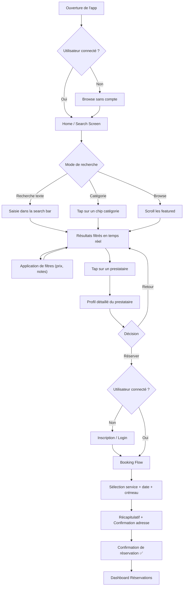
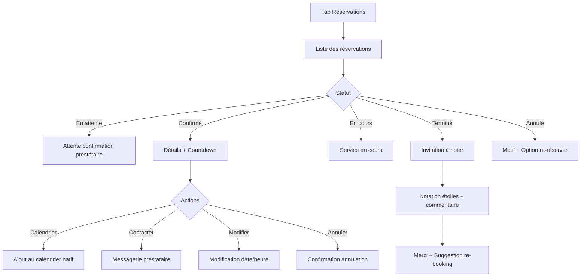
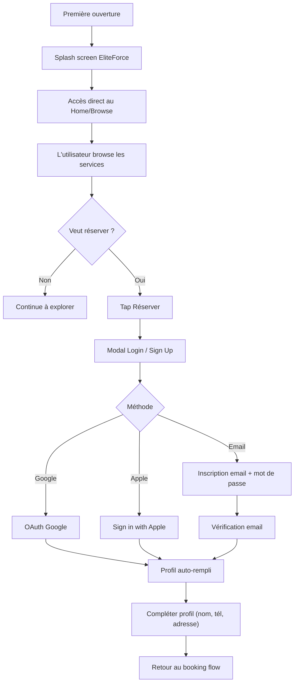

# UX Design Specification — TaskRabbit (EliteForce Multiservices)

**Author:** Dany
**Date:** 2026-03-24T00:32:00+01:00

---

## Executive Summary

### Project Vision

EliteForce Multiservices est une marketplace mobile de services à domicile destinée au marché marocain. Inspirée du modèle TaskRabbit, la plateforme connecte instantanément des **clients** à des **prestataires indépendants qualifiés** pour des services quotidiens : ménage, plomberie, électricité, jardinage, déménagement, peinture, bricolage, montage de meuble, et plus encore.

L'ambition UX est de résoudre le même défi que Big Human a adressé pour TaskRabbit : créer un parcours de réservation **intuitif, clair et sans friction** — éliminant les inconnues qui frustrent les utilisateurs ("Quel prestataire choisir ? Combien ça va coûter ? Que se passe-t-il après ma réservation ?").

La direction visuelle est résolument **minimaliste et premium** : fond blanc dominant, formes arrondies ("pill-based"), palette vert émeraude/sapin en couleur d'accent, typographie sans-serif moderne, et interfaces épurées sans surcharge d'information.

### Target Users

**Persona 1 — Le Client (demandeur de services)**

- Résident marocain (urbain principalement) cherchant un prestataire fiable pour des tâches à domicile
- Frustré par le manque de transparence du bouche-à-oreille : pas de visibilité sur la qualité, les prix, ou la disponibilité
- Attend : rapidité de recherche, comparaison facile (prix, avis, expérience), réservation en confiance, suivi du statut
- Technicité variable — l'interface doit être accessible à un public large

**Persona 2 — Le Prestataire indépendant (Tasker)**

- Professionnel du service à domicile cherchant à développer sa clientèle et sa visibilité
- A besoin de gérer son profil, ses services, ses tarifs, sa disponibilité et ses missions
- Attend : un outil simple qui lui apporte des clients sans friction administrative

### Key Design Challenges

1. **Clarté du parcours de réservation** — Comme identifié par Big Human pour TaskRabbit, le booking flow est le point de friction majeur. L'utilisateur doit comprendre à chaque étape : qui, quoi, combien, quand, et que se passe-t-il ensuite
2. **Confiance et transparence** — Sur un marché marocain où le bouche-à-oreille domine, l'app doit instaurer la confiance via les profils vérifiés, avis, et prix transparents
3. **Double interface Client/Prestataire** — Gérer deux expériences utilisateur distinctes au sein d'une même app (switch de rôle ou vues conditionnelles)
4. **Minimalisme sans perte d'information** — Créer des interfaces épurées qui communiquent néanmoins toutes les informations critiques (prix, disponibilité, avis, statut)

### Design Opportunities

1. **Design system cohérent "pill-based"** — Adopter le langage visuel TaskRabbit (border-radius généreux, chips de filtrage, boutons pill, cartes arrondies) pour créer une identité visuelle moderne et reconnaissable
2. **Recommandation intelligente de prestataires** — Comme TaskRabbit l'a fait avec Big Human : catégoriser les recommandations par budget, expérience, et avis pour guider le choix
3. **Dashboard post-réservation clair** — Redesigner la gestion des tâches avec des statuts visuels (en attente, à venir, en cours, terminée, annulée) et des détails clairs sur les coûts estimés et les prochaines étapes
4. **Light/Dark mode dès le design system** — Comme TaskRabbit, prévoir les deux modes avec une accessibilité au standard
5. **Palette verte "accomplishment"** — Exploiter la psychologie de la couleur verte (sentiment d'accomplissement après un travail bien fait) comme TaskRabbit l'a fait avec sa palette vert sapin/émeraude

### Visual Design Direction (from references)

| Élément | Direction |
|---|---|
| **Fond** | Blanc pur (#FFFFFF), gris très clair (#F4F4F4) pour les zones secondaires |
| **Couleur d'accent** | Vert sapin/émeraude (#0E7051 / #1B6E4A) |
| **Typographie** | Sans-serif géométrique (type Inter/Circular), hiérarchie nette Bold/Regular |
| **Border radius** | Généreux (16-24px cartes, full-round pour boutons et chips) |
| **Densité** | Minimaliste — peu de texte, espaces aérés, pas de clutter |
| **Composants clés** | Chips de filtrage horizontaux, cartes arrondies, photos de profil circulaires, tab bar simplifiée, grille de catégories 2 colonnes |
| **Navigation** | Tab bar basse avec icônes outline, simple et discrète |

## Core User Experience

### Defining Experience

**L'action fondamentale : "Trouver → Comparer → Réserver en moins de 5 minutes"**

Le cœur de l'expérience EliteForce est un tunnel de conversion ultra-optimisé qui emmène l'utilisateur de la découverte du besoin à la confirmation de réservation en **moins de 5 minutes**. Chaque écran, chaque tap, chaque information affichée doit servir cet objectif. Tout ce qui ralentit, distrait, ou crée de l'incertitude est un ennemi de la conversion.

Le flow critique se décompose en :

1. **Trouver** — L'utilisateur identifie le service dont il a besoin (catégorie, recherche, ou navigation)
2. **Comparer** — Il évalue les prestataires sur trois critères : prix, avis, et confiance (profil vérifié, expérience)
3. **Réserver** — Il choisit un créneau, confirme, et reçoit une confirmation immédiate avec toutes les informations nécessaires

### Platform Strategy

| Aspect | Décision |
|---|---|
| **Plateforme primaire** | Mobile-first (Expo/React Native — iOS & Android) |
| **Offline** | Non requis — connexion internet assumée |
| **Géolocalisation** | Prévue (phase ultérieure) — matching prestataires par proximité |
| **Notifications push** | Prévues (phase ultérieure) — rappels RDV, mises à jour statut, promotions |
| **Messagerie** | Prévue (phase ultérieure) — communication directe client ↔ prestataire |
| **Intégration calendrier** | Prévue — ajout du RDV au calendrier natif après réservation |
| **Web** | Non prioritaire — mobile-first exclusif pour le MVP |

### Effortless Interactions

**Ce qui doit être sans effort :**

1. **La recherche de service** — L'utilisateur tape "ménage" ou browse une catégorie et voit immédiatement des résultats pertinents avec prix et avis. Pas de formulaire long, pas de questions inutiles
2. **La comparaison de prestataires** — En un coup d'œil : photo, nom, prix/heure, note, nombre d'avis, badge vérifié. Pas besoin de cliquer sur chaque profil pour avoir l'essentiel
3. **La réservation** — Sélection du créneau → confirmation → c'est fait. Minimum d'étapes, maximum de clarté. Chaque étape du flow doit montrer un progress indicator
4. **Le post-réservation** — Confirmation immédiate avec récapitulatif, option "Ajouter au calendrier", et toutes les infos du RDV accessibles dans l'app à tout moment

**Ce qui doit disparaître (anti-patterns) :**

- Formulaires à rallonge avant de voir des résultats
- Écrans de chargement sans feedback
- Informations critiques cachées (prix final, conditions d'annulation)
- Flows qui obligent à revenir en arrière pour modifier un choix

### Critical Success Moments

| Moment | Impact | UX Requirement |
|---|---|---|
| **Premier résultat de recherche** | L'utilisateur décide en 3 secondes si l'app lui sera utile | Résultats pertinents, visuellement clairs, prix visible |
| **Comparaison prestataires** | La confiance se construit ici — "est-ce que ce prestataire est fiable ?" | Avis authentiques, badge vérifié, prix transparent, photo réelle |
| **Le moment "Réserver"** | Le point de conversion — tout friction ici = abandon | Bouton clair, récapitulatif prix, pas de surprise, progression visible |
| **L'écran de confirmation** | Le moment "accomplishment" — "c'est fait, c'est réglé" | Récapitulatif complet, ajout calendrier, contact prestataire, prochaine étape claire |
| **Le dashboard réservations** | La confiance post-achat — "je contrôle la situation" | Statut visuel clair, timeline, possibilité de modifier/annuler, noter après |

**Moment d'échec critique :** Un flow de booking confus, avec des étapes pas claires, pénibles, ou chronophages. La conversion meurt quand l'utilisateur ne sait pas où il en est, combien ça va coûter au final, ou combien de temps ça va encore prendre.

### Experience Principles

1. **⚡ 5-Minute Rule** — De la recherche à la confirmation, le parcours complet doit être réalisable en moins de 5 minutes. Chaque écran ajouté doit justifier son existence
2. **👁️ Glanceable Clarity** — Toute information critique (prix, avis, statut) doit être compréhensible en un coup d'œil, sans avoir besoin de cliquer ou scroller
3. **🎯 Zero Ambiguity** — À chaque étape du flow, l'utilisateur sait exactement : où il en est, ce qu'il doit faire, et ce qui va se passer ensuite
4. **💚 Instant Accomplishment** — Le moment de confirmation doit créer un sentiment immédiat de "c'est réglé". Récapitulatif complet, calendrier, contact — tout est là
5. **🔒 Trust by Default** — La confiance n'est pas demandée, elle est construite : prix transparents, avis vérifiés, profils complets, conditions claires

## Desired Emotional Response

### Primary Emotional Goals

| Émotion | Description | Pourquoi c'est critique |
|---|---|---|
| 🛡️ **Confiance** | "Cette app est sérieuse, ces prestataires sont fiables" | Sur un marché où le bouche-à-oreille domine, la confiance numérique est le premier obstacle à surmonter |
| ⚡ **Efficacité** | "C'est rapide, c'est fait, je n'ai pas perdu mon temps" | Le sentiment de productivité est le moteur de la rétention — l'utilisateur revient parce que c'est plus rapide que toute alternative |
| 😌 **Soulagement** | "Quelqu'un de compétent s'en occupe, je n'ai plus à y penser" | L'objectif final n'est pas de réserver, c'est de déléguer un problème. Le soulagement est l'émotion de la valeur délivrée |
| 🎯 **Contrôle** | "Je vois tout, je décide, pas de surprise" | Transparence totale sur les prix, le timing, et le statut élimine l'anxiété d'achat |

### Emotional Journey Mapping

| Étape du parcours | Émotion cible | Design implication |
|---|---|---|
| **Première ouverture** | Curiosité + Clarté | Onboarding minimal, valeur immédiatement visible, pas de mur d'inscription avant de voir les services |
| **Recherche d'un service** | Efficacité + Confiance | Résultats instantanés, catégories claires, prix visibles dès la liste |
| **Découverte des prestataires** | Réassurance + Intérêt | Photos réelles, badges vérifiés, avis authentiques, prix transparent — la confiance se construit visuellement |
| **Moment de la réservation** | Détermination + Sérénité | Récapitulatif clair, pas de coût caché, bouton d'action évident, progression visible |
| **Confirmation reçue** | Accomplissement + Soulagement | ✅ Animation de succès, récapitulatif complet, "Ajouter au calendrier", sentiment "c'est réglé" |
| **Jour du service** | Anticipation + Contrôle | Notification de rappel, infos du prestataire accessibles, possibilité de contacter |
| **Après le service** | Satisfaction + Gratitude | Notation simple et rapide, remerciement, suggestion de re-réservation |
| **Quand ça va mal** | Compréhension + Support | Message d'erreur humain, options claires (modifier, annuler, contacter support), jamais de cul-de-sac UX |

### Micro-Emotions

**Émotions à maximiser :**

- **Confiance → Certitude** — L'utilisateur ne *croit* pas que ça va bien se passer, il *sait* que ça va bien se passer
- **Efficacité → Vitesse perçue** — Même si le flow prend 3 minutes, il doit *sembler* prendre 30 secondes grâce aux transitions fluides et au feedback immédiat
- **Accomplissement → Fierté** — "J'ai trouvé le bon prestataire au bon prix, je suis malin"
- **Soulagement → Légèreté** — Le poids mental de la tâche à organiser disparaît au moment de la confirmation

**Émotions à éliminer :**

- **Confusion** — "Je ne comprends pas cette page" → navigation et hiérarchie limpides
- **Anxiété** — "Est-ce que le prix va changer ?" → transparence totale, pas de surprise
- **Frustration** — "Pourquoi ça me demande encore des infos ?" → minimum de champs, pas de répétition
- **Méfiance** — "C'est louche, je ne connais pas ce prestataire" → profils vérifiés, avis réels, historique visible
- **Impatience** — "C'est trop long" → skeleton screens, transitions fluides, feedback à chaque action

### Design Implications

| Émotion cible | Approche UX/UI |
|---|---|
| **Confiance** | Badges de vérification, avis avec photo, prix affichés sans ambiguïté, conditions d'annulation visibles |
| **Efficacité** | Recherche avec auto-suggestions, filtres rapides (chips), réservation en 3 taps max, pré-remplissage intelligent |
| **Soulagement** | Écran de confirmation avec animation ✅, récapitulatif exhaustif, bouton "Ajouter au calendrier" prominent |
| **Contrôle** | Dashboard réservations avec statuts visuels, timeline, possibilité de modifier/annuler à tout moment |
| **Anti-frustration** | Skeleton loading au lieu de spinners, messages d'erreur en langage humain, navigation "back" toujours disponible |
| **Anti-anxiété** | Prix total toujours visible pendant le flow de booking, pas de frais cachés, politique d'annulation claire dès le début |

### Emotional Design Principles

1. **🫱 Trust Before Transaction** — La confiance doit être établie avant de demander quoi que ce soit à l'utilisateur. Montrer les services, les prix, et les avis avant d'exiger une inscription
2. **🏃 Speed Is Respect** — Chaque seconde économisée communique du respect pour le temps de l'utilisateur. Les transitions, le loading, et les feedbacks doivent refléter cette urgence
3. **🎉 Celebrate Completion** — Chaque tâche accomplie (réservation, notation, inscription) mérite un micro-moment de célébration — animation subtile, message positif, couleur verte d'accomplissement
4. **🗣️ Human Language** — Toute communication (erreurs, confirmations, statuts) utilise un langage humain et rassurant, jamais technique ou froid
5. **🚫 No Dead Ends** — Aucune situation ne doit laisser l'utilisateur sans option. Chaque état d'erreur propose une action suivante claire

## UX Pattern Analysis & Inspiration

### Inspiring Products Analysis

#### TaskRabbit — Référence principale

**Ce que Big Human a réussi pour TaskRabbit :**

- **Booking flow clarifié** — Questions de cadrage optionnelles et éditables à tout moment, supprimant l'anxiété du "je ne peux pas revenir en arrière"
- **Recommandation de Taskers** — Catégorisation par budget, expérience, et avis pour guider le choix sans surcharger
- **Dashboard post-booking** — Statuts visuels (en attente, à venir, annulé, terminé) avec coûts estimés, timelines, et prochaines étapes
- **Identité visuelle cohérente** — Palette vert sapin avec variations sombres (accessibles), typographie optimisée pour le digital, component library exhaustive avec variants
- **Light & Dark mode** — Tous les écrans clés pensés dans les deux modes dès la conception

**Patterns UX clés à retenir :**

| Pattern | Implémentation TaskRabbit |
|---|---|
| Navigation | Tab bar basse minimaliste, icônes outline, navigation stack naturelle |
| Recherche | Barre de recherche proéminente + chips de filtrage horizontaux |
| Cartes prestataires | Photo circulaire + nom + prix/h + rating + badge — tout visible sans cliquer |
| Booking flow | Étapes progressives avec possibilité de modifier à tout moment |
| Confirmation | Récapitulatif complet avec breakdown des coûts et timeline |
| Empty states | Illustrations + message clair + CTA pour débloquer |

#### Glovo / Uber — Référence secondaire (booking & logistique)

**Ce qu'ils font bien :**

- **Feedback temps réel** — L'utilisateur voit le statut de sa commande/course en temps réel, éliminant l'anxiété d'attente
- **Estimation de prix avant booking** — Le prix estimé est visible avant de confirmer, pas de surprise
- **Onboarding minimal** — Valeur visible immédiatement, inscription repoussée au moment de l'action (booking)
- **Réservation en 3 taps** — Sélection → Confirmation → Fait. Pas de formulaire superflu

**Pertinence pour EliteForce :** Le public marocain urbain utilise déjà Glovo et Uber — adopter leurs conventions de navigation et de feedback réduit la courbe d'apprentissage.

#### WhatsApp — Référence culturelle (confiance & communication)

**Ce qu'il fait bien :**

- **Simplicité radicale** — Interface épurée, pas de clutter, focus sur l'action primaire
- **Confiance par la familiarité** — Les utilisateurs marocains font confiance à WhatsApp plus qu'à toute autre app
- **Communication directe** — Pas d'intermédiaire, pas de formulaire — on parle directement

**Pertinence pour EliteForce :** La messagerie in-app (phase ultérieure) devrait s'inspirer de la simplicité de WhatsApp. Le pattern de "contacter directement" est profondément ancré dans les habitudes locales.

### Transferable UX Patterns

**Navigation :**

- **Tab bar 4 onglets** (TaskRabbit) — Home, Search/Browse, Bookings, Profile. Simple, prévisible, standard mobile
- **Stack navigation** (TaskRabbit/Uber) — Pile d'écrans au-dessus des tabs pour les flows détaillés (détail service, booking, profil prestataire)
- **Barre de recherche proéminente en haut** (TaskRabbit/Glovo) — L'action principale est toujours accessible

**Interaction :**

- **Chips de filtrage horizontaux** (TaskRabbit) — Filtres rapides sans quitter l'écran de résultats, scrollables horizontalement
- **Pull-to-refresh** (standard mobile) — Rafraîchissement des listes par geste naturel
- **Swipe-to-dismiss** (standard iOS/Android) — Pour fermer les modales et les bottom sheets
- **Skeleton loading** (Glovo/Uber) — Feedback visuel immédiat pendant le chargement, pas de spinner

**Visual :**

- **Cartes arrondies avec ombre légère** (TaskRabbit) — Séparation visuelle douce sans bordures dures
- **Photos de profil circulaires** (TaskRabbit) — Humanisation et confiance
- **Badge vérifié** (Uber/TaskRabbit) — Indicateur de confiance immédiat (icône ✓ vert)
- **Rating avec étoiles + nombre d'avis** (TaskRabbit/Glovo) — Double signal de confiance : qualité + volume

**Booking :**

- **Progress indicator horizontal** (TaskRabbit) — Indique où l'utilisateur en est dans le flow de réservation
- **Récapitulatif sticky en bas** (Uber/Glovo) — Le prix total reste visible pendant tout le flow
- **Bouton CTA full-width en bas** (standard mobile) — Action principale toujours à portée de pouce

### Anti-Patterns to Avoid

| Anti-Pattern | Pourquoi l'éviter | Alternative |
|---|---|---|
| **Mur d'inscription avant de voir le contenu** | Tue la curiosité et la conversion first-time | Permettre le browse sans compte, exiger le login au moment du booking |
| **Formulaires multi-pages pour une simple recherche** | Frustration, abandon | Recherche libre + filtres optionnels en chips |
| **Prix "à partir de" sans détail** | Crée de la méfiance | Prix de base clair + détail du calcul visible |
| **Spinner plein écran** | Sensation de lenteur | Skeleton screens + contenu progressif |
| **Notifications excessives** | Désinstallation | Notifications pertinentes et actionnables uniquement |
| **Navigation hamburger** | Cache les fonctions, réduit la découvrabilité | Tab bar permanente avec 4 onglets maximum |
| **Scroll horizontal caché** | L'utilisateur ne sait pas qu'il y a plus de contenu | Indicateur visuel "peek" montrant le contenu suivant |
| **Boutons "Annuler" cachés ou absents** | Anxiété d'engagement | Politique d'annulation claire + bouton visible dans le dashboard |

### Design Inspiration Strategy

**Ce qu'on adopte directement :**

- Structure de navigation TaskRabbit (4 tabs + stack)
- Cartes prestataires avec photo, prix, rating en vue liste
- Chips de filtrage horizontaux pour la recherche
- Progress indicator dans le booking flow
- Palette verte d'accomplissement
- Composants pill-based (border-radius généreux)

**Ce qu'on adapte :**

- **Booking flow TaskRabbit** → Simplifier pour le contexte marocain : moins de questions de cadrage, aller plus vite au choix du prestataire et du créneau
- **Messagerie** → Inspirée de WhatsApp plutôt que du chat TaskRabbit, pour coller aux habitudes locales
- **Monnaie et prix** → Affichage en MAD (Dirham marocain), format adapté

**Ce qu'on évite :**

- La complexité du booking flow TaskRabbit v1 (trop de questions avant d'arriver aux recommandations)
- Le dark pattern du prix qui change entre la page et le checkout
- Les écrans de chargement sans squelette qui donnent une impression de lenteur

## Design System Foundation

### Design System Choice

**Approche hybride : NativeWind v4 + GlueStack UI sélectif + composants custom**

Le design system d'EliteForce repose sur une architecture à trois niveaux :

| Couche | Technologie | Rôle |
|---|---|---|
| **Styling** | NativeWind v4 + Tailwind CSS 3.4.x | Toutes les classes utilitaires, tokens de design, responsive |
| **Primitifs complexes** | GlueStack UI v3 (copy-paste) | Modales, bottom sheets, toasts, action sheets, overlays |
| **Composants métier** | Custom sur NativeWind | Cartes prestataire, chips, booking flow, profils, ratings |

### Rationale for Selection

1. **Continuité technique** — NativeWind v4 et GlueStack sont déjà intégrés dans la codebase existante. Zéro migration, zéro risque de régression
2. **Contrôle visuel total** — Les composants custom permettent de reproduire exactement l'esthétique TaskRabbit (pill-based, minimaliste, vert émeraude) sans les contraintes d'une UI lib opinionated
3. **Performance** — NativeWind compile en styles natifs, pas de runtime CSS lourd. GlueStack est utilisé uniquement quand c'est plus efficace que du custom
4. **Maintenabilité** — Les tokens vivent dans `global.css`, les composants dans `mobile/src/components/ui/`. Structure claire et extensible
5. **Accessibilité** — GlueStack intègre les props d'accessibilité sur les primitifs complexes (modales, overlays). Les composants custom doivent suivre les mêmes standards

### Implementation Approach

**Organisation des composants :**

```
mobile/src/
├── components/
│   ├── ui/              # Primitifs GlueStack (button, input, modal, toast...)
│   ├── common/          # Composants custom réutilisables (card, chip, badge, avatar, rating...)
│   └── layout/          # Composants de structure (safe-area, scroll-container, sticky-footer...)
├── features/
│   ├── services/components/   # Composants métier spécifiques (service-card, category-grid...)
│   ├── booking/components/    # Composants de booking (booking-stepper, price-summary...)
│   └── auth/components/       # Composants d'auth (login-form, register-form...)
└── tw/                  # Wrappers CSS NativeWind (View, Text, Pressable...)
```

**Design tokens dans `global.css` :**

- Couleurs de la palette (vert émeraude, gris, blanc, sémantiques)
- Espacement (4, 8, 12, 16, 20, 24, 32, 40, 48, 64)
- Border radius (sm: 8px, md: 12px, lg: 16px, xl: 24px, full: 9999px)
- Typographie (tailles, poids, line-heights)
- Ombres (sm, md, lg)

### Customization Strategy

**Composants prioritaires à créer/customiser :**

| Composant | Type | Style clé |
|---|---|---|
| **ServiceCard** | Custom | Carte arrondie (lg), photo, prix, rating, badge |
| **ProviderCard** | Custom | Photo circulaire, nom, prix/h, étoiles, badge vérifié |
| **FilterChip** | Custom | Pill full-round, état actif vert, scrollable horizontal |
| **CategoryTile** | Custom | Icône + label, grille 2 colonnes, fond gris clair, radius lg |
| **BookingStepper** | Custom | Progress bar horizontale, étapes avec labels |
| **PriceSummary** | Custom | Sticky bottom, breakdown des coûts, bouton CTA full-width |
| **RatingStars** | Custom | Étoiles + nombre d'avis, tailles S/M/L |
| **VerifiedBadge** | Custom | Icône ✓ vert, tooltip "profil vérifié" |
| **StatusBadge** | Custom | Pill coloré par statut (en attente, confirmé, terminé, annulé) |
| **EmptyState** | Custom | Illustration + message + CTA |
| **SkeletonLoader** | Custom | Placeholder animé (pulse) pour cartes et listes |
| **Button** | GlueStack custom | Variants: primary (vert), secondary (outline), ghost, sizes S/M/L |
| **Modal/BottomSheet** | GlueStack | Overlay avec backdrop, swipe-to-dismiss |
| **Toast** | GlueStack | Notifications in-app (succès, erreur, info) |
| **Input** | GlueStack custom | Border radius pill, états focus/error/disabled |

## Core User Experience (Detailed)

### Defining Experience

**"Tu cherches, tu filtres, tu réserves — tout depuis l'écran de recherche."**

L'expérience signature d'EliteForce est un **moteur de découverte centré sur la recherche**. Pas de wizard multi-étapes — tout se passe sur un seul écran puissant : localisation, recherche, catégories, filtres, résultats. L'utilisateur reste en contrôle, affine en temps réel, et passe directement au booking quand il trouve le bon prestataire.

### User Mental Model

**Le modèle mental est celui du "browse intelligent" :**

L'utilisateur pense : *"Je suis à [adresse], j'ai besoin de [service], montre-moi les meilleurs prestataires proches de chez moi."*

L'écran de recherche répond à cette pensée en une seule vue :

```
┌─────────────────────────────────┐
│ 📍 12 Rue Hassan II, Casablanca │  ← Localisation (pré-remplie, modifiable)
├─────────────────────────────────┤
│ 🔍 Rechercher un service...     │  ← Search bar
├─────────────────────────────────┤
│ [Ménage] [Plomberie] [Élec] →  │  ← Carousel catégories (chips)
├─────────────────────────────────┤
│ [Prix ▾] [Notes ▾] [Filtres]   │  ← Filtres additionnels
├─────────────────────────────────┤
│                                 │
│  ┌─────────────────────────┐    │
│  │ 📷 Ahmed M.    ⭐ 4.8  │    │  ← Résultats triés par
│  │ Ménage · 150 MAD/h     │    │     pertinence (prix/note)
│  │ ✓ Vérifié · 47 avis    │    │
│  └─────────────────────────┘    │
│  ┌─────────────────────────┐    │
│  │ 📷 Fatima Z.   ⭐ 4.9  │    │
│  │ Ménage · 180 MAD/h     │    │
│  │ ✓ Vérifié · 92 avis    │    │
│  └─────────────────────────┘    │
│           ...                   │
└─────────────────────────────────┘
```

**Comment les gens résolvent ce problème aujourd'hui au Maroc :**

| Méthode actuelle | Avantage | Frustration |
|---|---|---|
| Bouche-à-oreille | Confiance basée sur la relation | Limité au réseau personnel, pas de choix, pas de comparaison |
| Groupes WhatsApp/Facebook | Large audience, gratuit | Pas de vérification, prix opaques, fiabilité aléatoire |
| Pages Jaunes / Annuaires | Base de données large | Pas d'avis, pas de prix, obsolète |
| Plateformes généralistes (Avito) | Beaucoup d'offres | Pas spécialisé services, pas de booking, pas de confiance |

### Success Criteria

| Critère | Mesure de succès |
|---|---|
| **Vitesse** | Premiers résultats pertinents en < 2 secondes après un filtre |
| **Pertinence** | Le tri prix/note place les meilleurs rapport qualité/prix en premier |
| **Localisation** | L'adresse pré-remplie élimine une étape — l'utilisateur peut modifier à tout moment |
| **Filtrage fluide** | Chaque tap sur un chip/filtre met à jour les résultats instantanément (pas de bouton "Appliquer") |
| **Conversion** | De la recherche au tap "Réserver" sur un prestataire : < 60 secondes |
| **Re-engagement** | Les filtres se souviennent des préférences de l'utilisateur entre sessions |

### Novel UX Patterns

**Approche : Search-first, filter-driven, zero wizard**

| Pattern | Description | Pourquoi |
|---|---|---|
| **Localisation sticky en haut** | Adresse pré-remplie toujours visible et modifiable | Contexte géographique permanent sans action supplémentaire |
| **Catégories en carousel de chips** | Badges horizontaux scrollables sous la search bar | Filtrage rapide par catégorie en un tap, pas de page séparée |
| **Filtres additionnels inline** | Prix, notes en dropdowns/bottom sheets | Affinage sans quitter l'écran de résultats |
| **Tri par pertinence prix/note** | Algorithme combinant rapport qualité/prix | L'utilisateur voit le "meilleur deal" en premier, pas juste le moins cher |
| **Résultats en temps réel** | Chaque changement de filtre met à jour la liste instantanément | Feedback immédiat, sensation de contrôle |
| **Pas de wizard** | Zero question de cadrage avant de voir les résultats | L'utilisateur browse d'abord, précise après |

### Experience Mechanics

**Le flow complet :**

**1. Arrivée — L'écran de recherche est le hub principal**

- L'utilisateur ouvre l'app → Tab Search/Browse est l'écran par défaut (ou accessible en 1 tap)
- La localisation est pré-remplie avec son adresse (ou "Définir votre adresse" si première fois)
- La search bar est vide, prête à recevoir une requête
- Les catégories sont affichées en carousel de chips — aucune sélectionnée par défaut
- Les résultats par défaut montrent les services featured/populaires dans sa zone

**2. Découverte — Filtrage progressif**

- **Scénario A** : L'utilisateur tape "ménage" → résultats filtrés instantanément (debounce 400ms)
- **Scénario B** : Il tape le chip "Ménage" → même résultat, la catégorie est surlighnée en vert
- **Scénario C** : Il combine : chip "Plomberie" + filtre "⭐ 4+" + filtre "< 200 MAD/h"
- Les résultats se mettent à jour en temps réel à chaque modification
- Tri par défaut : pertinence (algorithme prix/note pondéré)
- Pull-to-refresh disponible

**3. Sélection — Tap sur un prestataire**

- → Navigation stack vers le profil détaillé du prestataire
- Photo, bio, tarifs détaillés, portfolio, tous les avis, disponibilités
- Bouton "Réserver" sticky en bas de l'écran
- Bouton "Contacter" pour messagerie (phase ultérieure)

**4. Réservation — Booking flow simplifié**

- Sélection du service spécifique (si le prestataire en propose plusieurs)
- Choix de la date et du créneau horaire
- Confirmation de l'adresse (pré-remplie depuis la recherche)
- Récapitulatif prix + conditions d'annulation
- Bouton "Confirmer" → Animation ✅ → Confirmation

**5. Post-réservation — Dashboard clair**

- La réservation apparaît dans le tab "Réservations"
- Statuts visuels : En attente / Confirmé / En cours / Terminé / Annulé
- Options : Ajouter au calendrier, Contacter, Modifier, Annuler
- Après le service : notification de notation

## Visual Design Foundation

### Color System

**Palette principale — inspirée de TaskRabbit :**

| Token | Hex | Usage |
|---|---|---|
| **primary-900** | `#04311F` | Texte sur fond vert clair, états pressed |
| **primary-800** | `#065230` | Headers sombres, dark mode accent |
| **primary-700** | `#0A6B40` | Boutons hover/pressed |
| **primary-600** | `#0E7051` | **Couleur d'accent principale** — boutons CTA, chips actifs, badges, liens |
| **primary-500** | `#12895F` | États focus, bordures actives |
| **primary-400** | `#3DA87A` | Icônes secondaires, progress bars |
| **primary-300** | `#7BC8A4` | Backgrounds légers, tags, badges secondaires |
| **primary-200** | `#B5E0CC` | Backgrounds hover, surfaces surélevées |
| **primary-100** | `#E0F2E8` | Backgrounds subtils, zones de highlight |
| **primary-50** | `#F0F9F3` | Background global teinté, surfaces de séparation |

**Neutres :**

| Token | Hex | Usage |
|---|---|---|
| **neutral-950** | `#0A0A0A` | Texte principal |
| **neutral-800** | `#262626` | Titres, labels importants |
| **neutral-600** | `#525252` | Texte secondaire, descriptions |
| **neutral-400** | `#A3A3A3` | Placeholders, texte tertiaire |
| **neutral-200** | `#E5E5E5` | Bordures, séparateurs |
| **neutral-100** | `#F4F4F4` | **Fond des cartes**, zones secondaires, chips inactifs |
| **neutral-50** | `#FAFAFA` | Fond de page alternatif |
| **white** | `#FFFFFF` | **Fond principal**, cartes surélevées |

**Sémantiques :**

| Token | Hex | Usage |
|---|---|---|
| **success** | `#16A34A` | Confirmation, validation, badges vérifiés |
| **warning** | `#F59E0B` | Alertes non-bloquantes, ratings étoiles |
| **error** | `#DC2626` | Erreurs de formulaire, annulation |
| **info** | `#2563EB` | Messages informatifs, liens secondaires |

**Règles de contraste (WCAG AA) :**

- Texte sur fond blanc : minimum `neutral-600` pour le texte body, `neutral-800` pour les titres
- Texte sur fond `primary-600` : blanc uniquement (ratio ≥ 4.5:1)
- Icônes interactives : minimum `neutral-600` sur fond blanc

### Typography System

**Famille de polices :**

| Usage | Police | Raison |
|---|---|---|
| **Primaire** | `Inter` | Sans-serif géométrique, excellente lisibilité sur mobile, très proche de la typographie TaskRabbit. Disponible via Google Fonts, poids optimisés pour le digital |
| **Mono (prix)** | `Inter` tabular nums | Les prix (150 MAD) utilisent des chiffres tabulaires pour un alignement visuel propre dans les listes |

**Échelle typographique :**

| Token | Taille | Poids | Line-height | Usage |
|---|---|---|---|---|
| **display** | 28px | Bold (700) | 1.2 | Titre page d'accueil, onboarding |
| **h1** | 24px | Bold (700) | 1.25 | Titres d'écran |
| **h2** | 20px | SemiBold (600) | 1.3 | Sous-titres, noms de section |
| **h3** | 17px | SemiBold (600) | 1.35 | Noms de prestataires, labels importants |
| **body** | 15px | Regular (400) | 1.5 | Texte courant, descriptions |
| **body-medium** | 15px | Medium (500) | 1.5 | Labels de formulaire, prix |
| **caption** | 13px | Regular (400) | 1.4 | Texte secondaire, timestamps, metadata |
| **caption-medium** | 13px | Medium (500) | 1.4 | Chips, badges, petit texte emphasis |
| **small** | 11px | Medium (500) | 1.3 | Labels minimaux, compteurs |

**Règles typographiques :**

- Jamais plus de **2 poids** visibles sur un même écran (Regular + SemiBold ou Regular + Bold)
- Les prix sont toujours en `body-medium` ou `h3` pour être visibles au premier coup d'œil
- Texte tronqué avec ellipsis après 2 lignes maximum pour les descriptions dans les cartes

### Spacing & Layout Foundation

**Unité de base : 4px**

| Token | Valeur | Usage |
|---|---|---|
| **space-1** | 4px | Padding interne icônes, micro-écarts |
| **space-2** | 8px | Écart entre lignes de texte, padding chips |
| **space-3** | 12px | Padding interne cartes, écart entre éléments liés |
| **space-4** | 16px | **Padding standard des conteneurs**, marges latérales écran |
| **space-5** | 20px | Écart entre sections mineures |
| **space-6** | 24px | Écart entre composants indépendants |
| **space-8** | 32px | Écart entre sections majeures |
| **space-10** | 40px | Marges top d'écran, espacement héro |
| **space-12** | 48px | Espacement large (avant footer, entre zones) |
| **space-16** | 64px | Espacement extra-large |

**Border radius :**

| Token | Valeur | Usage |
|---|---|---|
| **radius-sm** | 8px | Boutons texte, inputs, petits conteneurs |
| **radius-md** | 12px | Cartes de service, images |
| **radius-lg** | 16px | Cartes principales, modales |
| **radius-xl** | 24px | Cartes héro, images de profil rectangulaires |
| **radius-full** | 9999px | **Chips, boutons pill, avatars, search bar** |

**Ombres :**

| Token | Valeur | Usage |
|---|---|---|
| **shadow-sm** | `0 1px 2px rgba(0,0,0,0.05)` | Cartes au repos, chips |
| **shadow-md** | `0 4px 6px rgba(0,0,0,0.07)` | Cartes surélevées, boutons floating |
| **shadow-lg** | `0 10px 15px rgba(0,0,0,0.1)` | Modales, bottom sheets, éléments overlay |

**Layout :**

| Propriété | Valeur | Raison |
|---|---|---|
| **Marges latérales écran** | 16px | Standard mobile, cohérent avec iOS/Android |
| **Grille de catégories** | 2 colonnes, gap 12px | Catégories lisibles avec icône + label |
| **Liste de résultats** | 1 colonne, gap 12px | Cartes prestataires full-width pour maximiser l'info visible |
| **Carousel horizontal** | peek 24px côté droit | Indique visuellement qu'il y a plus de contenu |
| **Sticky bottom bar** | 80px hauteur, padding 16px | Zone CTA + prix, toujours visible |
| **Tab bar** | 56px hauteur | Standard iOS/Android |

### Accessibility Considerations

| Aspect | Standard | Implémentation |
|---|---|---|
| **Contraste texte** | WCAG AA (4.5:1 minimum) | Tous les textes sur fond blanc utilisent `neutral-600`+ |
| **Contraste boutons** | WCAG AA (3:1 minimum) | Texte blanc sur `primary-600` = ratio 5.2:1 ✅ |
| **Touch targets** | 44x44px minimum | Tous les boutons, chips, et éléments interactifs |
| **Focus indicators** | Ring 2px `primary-500` | Visible en navigation clavier/assistive |
| **Taille de police minimum** | 11px (small) | Limité aux labels non-critiques |
| **Motion** | `prefers-reduced-motion` | Désactiver animations si l'utilisateur le demande |
| **Lecteur d'écran** | Labels accessibles | `accessibilityLabel` sur tous les composants interactifs |

## Design Direction Decision

### Design Directions Explored

Trois directions ont été évaluées pour EliteForce :

| Direction | Description | Pour | Contre |
|---|---|---|---|
| **A — TaskRabbit Pure** | Réplique fidèle du design TaskRabbit : vert sapin, cartes arrondies, tab bar minimaliste, fond blanc pur | Modèle prouvé, reconnaissance immédiate du pattern | Manque de différenciation visuelle |
| **B — Glovo Hybride** | Densité d'information plus élevée, cartes en grille, code couleur par catégorie | Plus de contenu visible, navigation rapide | Potentiellement trop dense, moins premium |
| **C — Premium Minimaliste** | Fond blanc, espaces généreux, micro-animations, accent émeraude subtil, emphase sur les photos | Sensation très premium, design mémorable | Plus d'effort de production (photos quality) |

### Chosen Direction

**Direction C — Premium Minimaliste**, enrichie des patterns UX de la Direction A (TaskRabbit).

C'est le meilleur des deux mondes : l'esthétique premium et aérée qui reflète la qualité des prestataires, combinée avec les patterns de navigation et de booking flow éprouvés de TaskRabbit.

### Design Rationale

1. **Différenciation** — Le marché marocain n'a pas encore de référence design pour les services. Arriver avec un design premium positionne EliteForce comme le leader en qualité
2. **Confiance** — Un design aéré et soigné communique la fiabilité et le sérieux — exactement ce que les utilisateurs cherchent quand ils invitent quelqu'un chez eux
3. **Utilisabilité** — Les patterns TaskRabbit (tab bar, chips, cartes prestataires, booking flow progressif) sont gardés intacts car prouvés efficaces
4. **Photos-first** — Les photos des prestataires et de leurs réalisations sont mises en avant, humanisant l'expérience et renforçant la confiance

### Implementation Approach

- **Fond** : Blanc pur (`#FFFFFF`) pour les pages principales, `neutral-50` pour les zones de séparation
- **Cartes** : Élévation légère (`shadow-sm`), `radius-lg` (16px), padding généreux
- **Espacement** : Aéré — utilisation systématique de `space-6` (24px) entre les sections
- **Photos** : Priorité aux photos de profil de qualité, `radius-full` pour les avatars (circulaires)
- **Animations** : Micro-animations subtiles sur les transitions d'écran, les boutons (scale 0.98 au press), et la confirmation de réservation
- **Typographie** : Inter, poids contrastés (Regular pour le body, Bold pour les titres), pas plus de 2 niveaux de hiérarchie visibles simultanément

## User Journey Flows

### Journey 1 : Découverte et Réservation (Parcours principal)



### Journey 2 : Gestion Post-Réservation



### Journey 3 : Onboarding et Inscription



### Journey Patterns

| Pattern | Description | Application |
|---|---|---|
| **Delayed Authentication** | L'inscription n'est demandée qu'au moment de la réservation, pas avant | Maximise l'exploration et la découverte avant de demander un engagement |
| **Persistent Context** | La localisation et les filtres sont conservés entre les sessions | L'utilisateur retrouve son contexte sans avoir à tout re-configurer |
| **Progressive Disclosure** | Les détails du prestataire sont révélés en couches (carte → profil → avis complets) | Réduit la surcharge cognitive, chaque niveau apporte plus de détail |
| **Sticky CTA** | Le bouton d'action principal reste visible en bas de l'écran | L'utilisateur peut agir à tout moment sans scroller |
| **Confirmation Celebration** | Animation de succès + récapitulatif complet après une action importante | Crée un sentiment d'accomplissement et renforce la confiance |

### Flow Optimization Principles

1. **Minimum Viable Input** — Ne demander que les informations strictement nécessaires à chaque étape. Le reste est pré-rempli ou optionnel
2. **Always Recoverable** — Chaque étape du flow permet de revenir en arrière sans perdre les données saisies
3. **Instant Feedback** — Chaque action de l'utilisateur déclenche un retour visuel immédiat (< 100ms pour les taps, skeleton pour le loading)
4. **Smart Defaults** — L'adresse, la date ("Prochain créneau disponible"), et la catégorie la plus utilisée sont pré-sélectionnés

## Component Strategy

### Design System Components (GlueStack UI)

Composants utilisés directement depuis GlueStack avec customisation NativeWind :

| Composant | GlueStack | Customisation |
|---|---|---|
| **Button** | `@gluestack-ui/button` | Variants primary (vert), secondary (outline), ghost. Radius-full, tailles S/M/L |
| **Input** | `@gluestack-ui/input` | Radius-full, border `neutral-200`, focus ring `primary-500` |
| **Modal** | `@gluestack-ui/modal` | Backdrop blur, radius-lg, swipe-to-dismiss |
| **Toast** | `@gluestack-ui/toast` | Succès (vert), erreur (rouge), info (bleu). Position top |
| **ActionSheet** | `@gluestack-ui/actionsheet` | Bottom sheet avec handle, radius-xl en haut |
| **Pressable** | `@gluestack-ui/pressable` | Scale animation (0.98) au press |
| **Switch** | `@gluestack-ui/switch` | Track `primary-600` quand actif |
| **Checkbox** | `@gluestack-ui/checkbox` | Check `primary-600`, radius-sm |

### Custom Components

#### SearchHeader

**Purpose:** Zone de recherche sticky en haut de l'écran de recherche
**Anatomy:** Localisation (📍 adresse) + Search bar + Carousel chips catégories
**States:** Default, searching (loading), filtered (chips actifs surlignés)
**Variants:** Compact (scrollé, réduit la localisation) / Expanded (position initiale)

#### ProviderCard

**Purpose:** Carte de présentation d'un prestataire dans les résultats
**Anatomy:** Photo (circulaire, 56px) | Nom + Service | Prix/h (MAD) | Rating (étoiles + nb avis) | Badge vérifié
**States:** Default, pressed (scale 0.98), skeleton loading
**Variants:** Compact (liste) / Extended (avec description courte)

#### FilterChip

**Purpose:** Chip de filtrage rapide dans le carousel horizontal
**Anatomy:** Label (+ icône optionnelle)
**States:** Inactive (fond `neutral-100`, texte `neutral-800`) / Active (fond `primary-600`, texte blanc)
**Variants:** Simple (catégorie) / Dropdown (prix, notes — affiche un chevron)

#### CategoryTile

**Purpose:** Tuile de catégorie dans la grille du Home
**Anatomy:** Icône (32px) + Label
**States:** Default (fond `neutral-100`), pressed (fond `primary-50`)
**Layout:** Grille 2 colonnes, gap 12px, radius-lg

#### BookingStepper

**Purpose:** Indicateur de progression dans le booking flow
**Anatomy:** 3 étapes : Détails → Confirmation → Validé
**States:** Complété (cercle vert + check) / Actif (cercle vert vide) / À venir (cercle gris)
**Position:** Haut de la page, sous le header

#### PriceSummary

**Purpose:** Récapitulatif des coûts sticky en bas pendant le booking
**Anatomy:** Lignes détaillées (service, frais, total) + Bouton CTA full-width
**States:** Calcul en cours (shimmer) / Affiché
**Position:** Sticky bottom, shadow-md

#### RatingStars

**Purpose:** Affichage et saisie de note en étoiles
**Anatomy:** 5 étoiles + nombre d'avis
**States:** Display (non interactif) / Input (tapable, animation de remplissage)
**Variants:** Size S (13px, pour les cartes) / Size M (17px, pour les profils) / Size L (24px, pour la notation)

#### StatusBadge

**Purpose:** Badge de statut de réservation
**Anatomy:** Pill coloré avec label
**Variants:** En attente (orange) / Confirmé (vert) / En cours (bleu) / Terminé (gris) / Annulé (rouge)

#### EmptyState

**Purpose:** État vide pour les listes sans contenu
**Anatomy:** Illustration + Titre + Description + CTA optionnel
**Usage:** Aucun résultat de recherche, aucune réservation, premier lancement

#### SkeletonLoader

**Purpose:** Placeholder animé pendant le chargement
**Anatomy:** Formes grises pulsées imitant la structure du contenu à venir
**Variants:** ProviderCard skeleton / CategoryTile skeleton / ProfileDetail skeleton

### Component Implementation Strategy

**Phase 1 — MVP (booking flow fonctionnel) :**

- SearchHeader, FilterChip, ProviderCard, CategoryTile
- Button, Input, Modal (GlueStack)
- BookingStepper, PriceSummary
- SkeletonLoader, EmptyState
- StatusBadge, RatingStars (display only)

**Phase 2 — Post-booking (gestion des réservations) :**

- RatingStars (input mode)
- Toast notifications
- ActionSheet (modifications, annulation)
- Messagerie composants (phase ultérieure)

**Phase 3 — Enhancement :**

- Push notification composants
- Calendar integration UI
- Mapview pour la géolocalisation
- Provider portfolio gallery

## UX Consistency Patterns

### Button Hierarchy

| Niveau | Style | Usage | Exemple |
|---|---|---|---|
| **Primary** | Fond `primary-600`, texte blanc, radius-full, full-width | Action principale de la page | "Confirmer la réservation", "Rechercher" |
| **Secondary** | Fond transparent, border `primary-600`, texte `primary-600`, radius-full | Action secondaire | "Contacter", "Voir plus" |
| **Ghost** | Fond transparent, texte `primary-600`, pas de border | Action tertiaire, liens | "Annuler", "Passer" |
| **Destructive** | Fond `error`, texte blanc, radius-full | Action irréversible | "Annuler la réservation" |

**Règle : maximum 1 bouton Primary par écran.**

### Feedback Patterns

| Type | Visuel | Durée | Usage |
|---|---|---|---|
| **Succès** | Toast vert + icône ✅ en haut | 3 secondes, auto-dismiss | Réservation confirmée, profil mis à jour |
| **Erreur** | Toast rouge + icône ❌ en haut | Persist jusqu'au dismiss | Échec de paiement, erreur réseau |
| **Warning** | Toast orange + icône ⚠️ | 5 secondes | Créneau presque plein, connexion lente |
| **Info** | Toast bleu + icône ℹ️ | 3 secondes | Mise à jour de statut, notification |
| **Loading** | Skeleton screens (pas de spinner) | Jusqu'au chargement | Tout chargement de contenu |
| **Empty** | Illustration + message + CTA | Persistant | Pas de résultats, pas de réservations |

### Form Patterns

| Pattern | Implémentation |
|---|---|
| **Validation** | En temps réel (inline), message d'erreur sous le champ en rouge |
| **Labels** | Toujours visibles (floating label ou label fixe au-dessus) |
| **Champs obligatoires** | Marqués avec * uniquement si certains champs sont optionnels |
| **Autocomplétion** | Activée pour l'adresse et la recherche de service |
| **Clavier** | Type de clavier adapté au champ (email, numérique, texte) |
| **CTA submit** | Toujours en bas, disabled tant que le formulaire n'est pas valide |

### Navigation Patterns

| Pattern | Implémentation |
|---|---|
| **Tab Bar** | 4 onglets : Home • Search • Réservations • Profil. Icônes outline (inactif) / filled (actif). Couleur `primary-600` actif, `neutral-400` inactif |
| **Stack Navigation** | Push/pop standard pour les flows détaillés. Back button toujours présent. Swipe-back sur iOS |
| **Bottom Sheet** | Pour les filtres, les actions contextuelles, les confirmations. Handle visible, swipe-to-dismiss |
| **Deep Link** | Support des liens vers des services et prestataires spécifiques |
| **Back Behavior** | Le bouton back revient toujours à l'état précédent sans perdre les données |

### Additional Patterns

| Pattern | Implémentation |
|---|---|
| **Pull-to-refresh** | Sur toutes les listes de contenu. Animation de rotation subtile |
| **Infinite scroll** | Pour les résultats de recherche. Loader en bas de liste |
| **Haptic feedback** | Sur les boutons de confirmation et les actions critiques (iOS) |
| **Swipe actions** | Swipe gauche sur une réservation pour annuler/modifier (optionnel) |
| **Onboarding tooltip** | Première utilisation uniquement, pointant les fonctions clés sans bloquer |

## Responsive Design & Accessibility

### Responsive Strategy

**Mobile-first exclusif pour le MVP.**

EliteForce est une application mobile native (Expo/React Native). Le responsive concerne les différentes tailles d'écran mobiles, pas l'adaptation web.

| Catégorie | Tailles | Adaptation |
|---|---|---|
| **Petit mobile** | 320-375px (iPhone SE, anciens Android) | Grille catégories 2 colonnes, cartes pleine largeur, texte body 14px |
| **Mobile standard** | 376-428px (iPhone 14, Galaxy S) | Design de référence — tous les tokens appliqués tels quels |
| **Grand mobile** | 429px+ (iPhone Pro Max, tablettes en mode portrait) | Espacement légèrement plus généreux, possibilité de grille 3 colonnes pour les catégories |

### Breakpoint Strategy

| Breakpoint | Valeur | Changements |
|---|---|---|
| **sm** | < 375px | Typographie réduite (-1px), marges latérales 12px, images prestataires 48px |
| **md** | 375-428px | **Design de référence** — tous les tokens standards |
| **lg** | > 428px | Marges latérales 20px, images prestataires 64px, cartes avec plus de whitespace |

Ces breakpoints sont gérés via les responsive modifiers de NativeWind (`sm:`, `md:`, `lg:`).

### Accessibility Strategy

**Niveau cible : WCAG AA**

| Domaine | Exigence | Implémentation |
|---|---|---|
| **Contraste** | 4.5:1 texte normal, 3:1 grands titres | Vérifié dans notre palette de couleurs |
| **Touch targets** | 44x44px minimum | Tous les éléments interactifs |
| **Screen reader** | `accessibilityLabel` sur tout composant interactif | Labels descriptifs en français |
| **Focus order** | Ordre de lecture logique (haut → bas, gauche → droite) | Props `accessibilityRole` et `accessibilityState` |
| **Animations** | Respecter `prefers-reduced-motion` | Désactivation conditionnelle de toutes les animations |
| **Taille de texte** | Support du scaling système (Dynamic Type iOS, Font Size Android) | Utilisation de rem pour les tailles de texte |
| **Contraste en Dark Mode** | Mêmes ratios WCAG AA en mode sombre | Palette dark adaptée avec contraste vérifié |

### Testing Strategy

| Type de test | Outil | Fréquence |
|---|---|---|
| **Accessibilité automatisée** | `eslint-plugin-react-native-a11y` | À chaque commit |
| **Screen reader** | VoiceOver (iOS), TalkBack (Android) | À chaque sprint |
| **Tailles d'écran** | Expo Go sur devices physiques variés | À chaque sprint |
| **Contraste** | Plugin Figma "Stark" + vérification manuelle | À chaque nouveau composant |
| **Touch targets** | Vérification manuelle + inspector React Native | À chaque nouveau composant |
| **Dynamic Type** | Test avec tailles de texte iOS/Android extrêmes | À chaque sprint |

### Implementation Guidelines

**Règles de développement :**

1. **Tout composant interactif** doit avoir un `accessibilityLabel` et un `accessibilityRole`
2. **Tout état visuel** (erreur, succès, loading) doit être annoncé au screen reader via `accessibilityLiveRegion`
3. **Les images** ont toujours un `accessibilityLabel` descriptif (ou `accessibilityElementsHidden` si décorative)
4. **Les formulaires** utilisent `accessibilityHint` pour les champs importants
5. **Les animations** sont wrappées dans un check `useReducedMotion()` et désactivées si nécessaire
6. **Les couleurs sémantiques** ne doivent jamais être le seul indicateur d'état — toujours accompagnées d'une icône ou d'un texte
